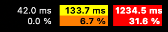
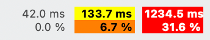

[](https://github.com/cybershoe/PingrThingr/actions/workflows/pytest-codecov.yml)
[](https://codecov.io/gh/cybershoe/PingrThingr)

 

# PingrThingr

PingrThingr is macOS menu bar application for monitoring network c  onnectivity through continuous ping monitoring. PingrThingr provides at-a-glance visibility into your connection quality with color-coded status indicators and customizable ping targets. Useful for rail or air commuters who regularly pass through coverage dead zones; see with a glance whether your connection has recovered, without constantly hitting refresh and hoping for the best.

## Features

- **Background Network Monitoring**: Continuously checks multiple ping targets
- **Menu Bar Integration**: Lives in your macOS menu bar for always-visible network status
- **Multiple Display Modes**: Choose between different visual representations
  - **Dot Mode**: Simple colored circle indicator (default)
  
    
  - **Text Mode**: Detailed latency and packet loss statistics
  
    


- **Color-coded Status Indicators**: Visual feedback with different colors based on latency and packet loss thresholds
  - Normal (Uncolored): Ping <80ms, 0% packet loss
  - Yellow: Ping 80-500ms, >0-5% packet loss
  - Orange: Ping 500-1000ms, 5-25% packet loss
  - Red: Ping >1000ms, >25% packet loss  
  - Dotted: No data available

- **Customizable Targets**: By default, PingrThingr checks 2 Google DNS and 2 Cloudflare DNS targets, but you can add or remove addresses as desired

- **Outlier Filtering**: Discards anomalous results for more accurate measurements; you care about your connection quality, not a brief outage of one of the ping targets.

## Installation

1. Go to the [latest release](https://github.com/cybershoe/PingrThingr/releases/latest)
2. Scroll down to "Assets" and download the latest .dmg disk image
3. Mount the image and drag "PingrThingr" into your Applications folder

Or, see [Building from Source](#building-from-source) below

## Usage

1. **Starting**: Launch PingrThingr and it will appear in your menu bar
2. **Monitoring**: The icon shows current network status with color coding
3. **Display Modes**: Switch between dot and text display modes via the "Display Mode" menu
4. **Pausing**: Use the "Pause" menu item to temporarily stop monitoring
5. **Configuration**: Access "Ping targets" to modify which servers to monitor

### Changing Display Mode

1. Click the PingrThingr icon in your menu bar
2. Select "Display Mode"
3. Choose either "Dot" or "Text" from the submenu

- **Dot Mode**: Shows a simple colored circle that changes color based on network status
- **Text Mode**: Displays detailed latency and packet loss statistics in the menu bar

### Customizing Targets

1. Click the PingrThingr icon in your menu bar
2. Select "Ping targets"
3. Enter comma-separated IP addresses in the dialog
4. Click "Save" to apply changes

**Note**: Only IPv4 addresses are currently supported.

## Building from Source

### Requirements

- macOS 14 or later
- Python 3.10 or later

### Dependencies

Install the required Python packages:

```bash
pip install -r requirements.txt
```

Required packages:
- `rumps`: For macOS menu bar application framework
- `icmplib`: For network ping functionality
- `pyobjc`: For macOS system integration

### Building the Application

To create a standalone macOS application bundle:

```bash
python setup.py py2app
```

This will create a `dist/PingrThingr.app` bundle that can be moved to your Applications folder.

### Running from Source

For development or testing:

```bash
python main.py
```

### Debug Mode

Enable debug output by setting the `LOGLEVEL` environment variable to `INFO` or `DEBUG`

```bash
LOGLEVEL=DEBUG python main.py
```

### Testing Notes

The unit tests will render NSView and NSImages objects for varios icon styles and values, and compare those to the exemplar images at tests/pingrthingr/icons/resources. Since there are subtle rendering differences between platforms, these examples are not committed to git. The first time you run pytest, it will generate new examples if they are not already present, and you should visually check them to ensure they are rendering correctly before making any changes that could potentially affect rendering.

---
Copyright (c) 2026 Adam Schumacher

For questions, issues, or feature requests, please use the GitHub issue tracker.
